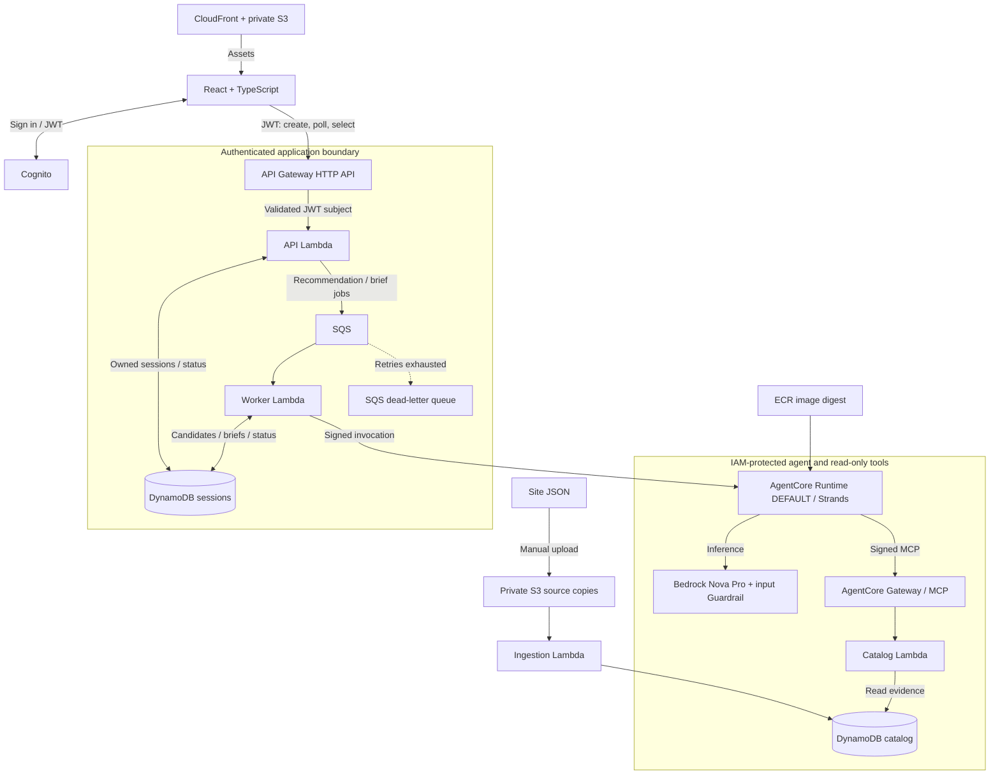
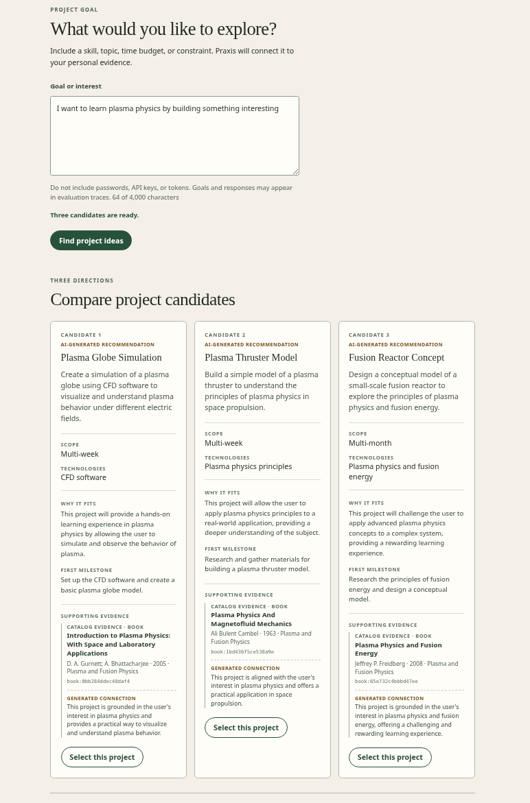
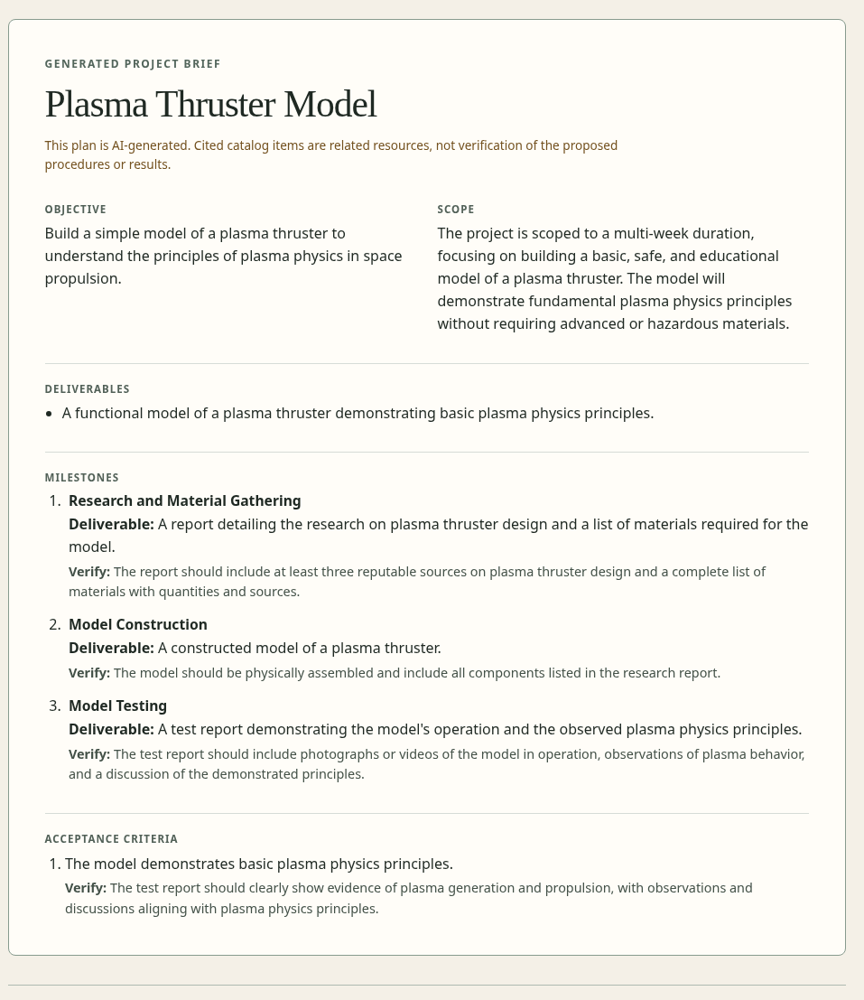

# praxis

An Amazon Bedrock and AgentCore app that uses personal evidence to recommend projects.

I wanted to see a basic AgentCore app doing something mildly interesting.
I used my data from [barrettotte.github.io](https://github.com/barrettotte/barrettotte.github.io/tree/master/data).

Summary: Describe a learning goal, compare three evidence-backed projects, and select one
for a brief with deliverables, milestones, risks, and acceptance checks.
Retrieval uses book, project, technical-note, and computing-museum metadata—not
book contents or a semantic Knowledge Base.

## Architecture



OpenTofu manages the serverless stack. Recommendations and briefs run
asynchronously; the browser polls for buffered results. `DEFAULT` follows Runtime
updates automatically. These are logical access boundaries, not VPCs.
CloudWatch logs, ADOT/X-Ray traces, a dashboard, and SNS alarms provide observability.
See [architecture](docs/architecture.md) for design choices and constraints.

This is a single-user demo with a shared catalog and expiring, subject-owned
sessions, not cross-session personalization. Citations establish provenance—not
correctness or feasibility. Do not submit secrets: traces can contain model
inputs and outputs. Model calls cost money; retries can repeat charges, and
budget alerts are not a spending cap. See [security limits](docs/security.md).

## UI Screenshots

Frontend wasn't the focus of this project, so its very generic and not great.
But, here's an example of generating ideas based on a given goal.





## Development

Requires Python 3.13, uv, Node.js 24–26, npm, and Make.

```sh
make bootstrap
make check
make help
```

Installation needs network access; checks run without AWS credentials.
The repository contains `backend/`, `frontend/`, `infra/`, and `evals/`.
Use `make security` to scan dependencies and the built Runtime image with
Podman or Docker; see [scanning](docs/security.md#scanning).

## Run with AWS

Follow [account and deployment setup](docs/infrastructure-operations.md),
then [create your application login](frontend/README.md#application-user-setup).
For local Vite development, configure the frontend and run `make dev-frontend`;
it still uses deployed AWS authentication and APIs.

For the CLI, configure `.env` from `.env.example` and run:

```sh
make agent PROMPT='Suggest a weekend Python project about computing history'
```

CLI inference is also metered. `make smoke-dev` checks the public boundary
without model calls; API and Runtime suites incur charges.

## Guides

- [Architecture](docs/architecture.md) — boundaries and tradeoffs.
- [Agent runtime](docs/agent-runtime.md) and [API](docs/api.md) — execution and contracts.
- [Operations](docs/infrastructure-operations.md) — deployment, diagnostics, and teardown.
- [Security](docs/security.md) — controls, scanning, and limitations.
- [Evaluations](evals/README.md) — offline checks and metered evaluation.
