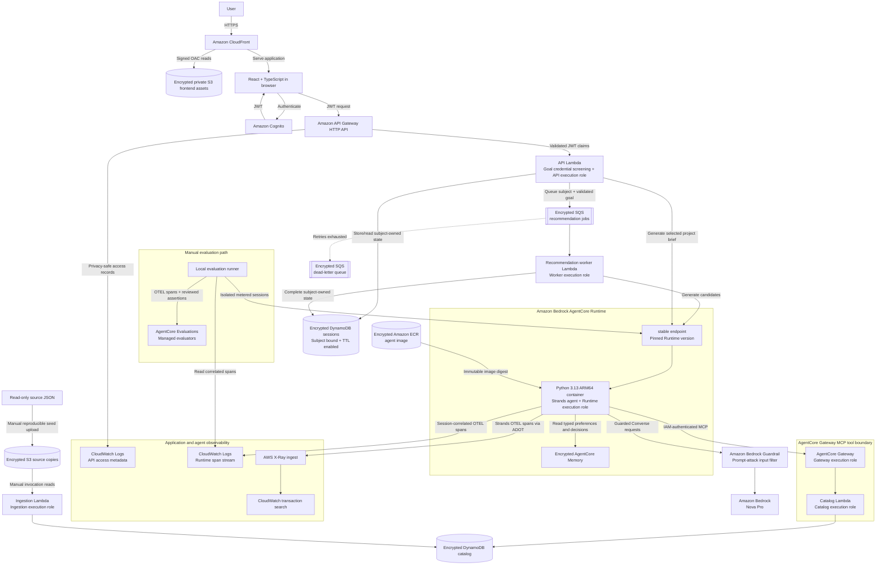

# praxis

An Amazon Bedrock and AgentCore app that uses personal evidence to recommend worthwhile software projects and turn ideas into actionable briefs.

I wanted to see a basic AgentCore app doing something mildly interesting.
I used my data from [barrettotte.github.io](https://github.com/barrettotte/barrettotte.github.io/tree/master/data).

## Architecture

Praxis follows this serverless architecture:



API Gateway is the application boundary, while AgentCore Gateway is the
authenticated tool boundary. Application routes use Cognito JWT authorization
and bind session access to the validated token subject;
AgentCore Runtime and Gateway remain IAM-authenticated internal boundaries.
The API rejects recognizable pasted credentials in new goals before storing or
queueing them. This is limited screening, not a guarantee that prompts or traces
are secret-free; see [input-screening limits](docs/agent-runtime.md#credential-isolation).
OpenTofu manages the AWS infrastructure.

## Development

Praxis is a monorepo with a Python backend in `backend/`, a React and TypeScript
application in `frontend/`, OpenTofu configuration in `infra/`, and evaluation
fixtures in `evals/`.

Install the Python 3.13 environment and list the available commands:

```bash
make bootstrap
make help
```

Run all local quality checks with `make check`. Deployed smoke checks use one
suite command; `make smoke-dev` runs the non-inference configuration suite, and
`./scripts/smoke/smoke-dev.sh --help` lists the explicitly metered suites.

The frontend requires the public Cognito and API values shown in
`frontend/.env.example`; `frontend/README.md` describes the local setup.

Copy `.env.example` to `.env`, refresh the `praxis-dev` AWS session, and run the
local evidence-backed command-line demonstration:

```bash
make agent PROMPT='Build a small Python project inspired by computing history'
```

The command renders three readable candidates with evidence IDs. Use
`uv run praxis --json 'your goal'` for the validated JSON representation, or
`--data-dir data/fixtures` to use synthetic fixtures. Run `make dev-frontend` to
start the Vite development server.

The [agent runtime guide](docs/agent-runtime.md) documents the Strands loop,
AgentCore Gateway tool boundary, and evidence-grounding invariants. Deployment
and teardown commands are in
[the infrastructure operations guide](docs/infrastructure-operations.md).
