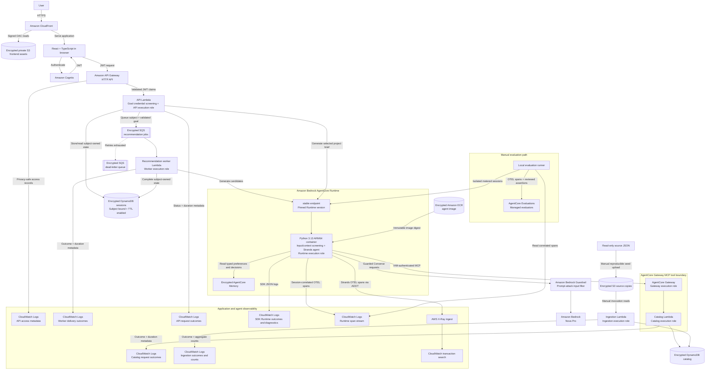

# praxis

An Amazon Bedrock and AgentCore app that uses personal evidence to recommend worthwhile software projects and turn ideas into actionable briefs.

I wanted to see a basic AgentCore app doing something mildly interesting.
I used my data from [barrettotte.github.io](https://github.com/barrettotte/barrettotte.github.io/tree/master/data).

Describe a learning goal, compare three evidence-backed candidates, then select
one for a brief with deliverables, milestones, risks, and acceptance checks.
Retrieval uses book, project, technical-note, and computing-museum metadata in
DynamoDB—not a semantic Knowledge Base or externally fetched book contents.

This is a single-user demonstration. Citations identify retrieved evidence;
they do not prove generated advice is correct or feasible. Do not submit secrets
or sensitive material. Security findings and deployment-verification gaps remain
open in the [residual-risk register](docs/residual-risks.md).

## Architecture

Praxis follows this serverless architecture. Application trace propagation across
SQS and Runtime is implemented locally; Lambda export and deployed verification
remain pending ([trace boundary](docs/adr/0028-trusted-trace-propagation.md)). The
diagram shows the deployed observability paths:



API Gateway is the application boundary, while AgentCore Gateway is the
authenticated tool boundary. Application routes use Cognito JWT authorization
and bind session access to the validated token subject;
AgentCore Runtime and Gateway remain IAM-authenticated internal boundaries.
The API rejects recognizable pasted credentials in new goals before storing or
queueing them. Runtime and CLI entry points share the detector; model-bound
retrieval and brief context are screened too. This is limited screening, not a guarantee that prompts or traces
are secret-free; see [input-screening limits](docs/agent-runtime.md#credential-isolation).
OpenTofu manages the AWS infrastructure.

## Development

Praxis is a monorepo with a Python backend in `backend/`, a React and TypeScript
application in `frontend/`, OpenTofu configuration in `infra/`, and evaluation
fixtures in `evals/`.

Prerequisites: Python 3.13, uv, Node.js 24–26, npm, and Make. Install locked
dependencies and run local checks without AWS credentials:

```bash
make bootstrap
make check
make help
```

Dependency installation needs network access. `make check` runs Ruff, type
checks, backend/frontend tests, schema checks, and the recorded evaluation
regression gate without AWS calls. `make eval-check` runs the focused offline
evaluation checks.

Run `make security` to scan locked dependencies and the built local Runtime
image. It requires Podman (or `CONTAINER_TOOL=docker`) and network access, but
no AWS credentials. See [security scanning](docs/security-scanning.md) for
coverage, reports, and finding triage.

## Run with AWS

Model commands incur AWS charges even when run locally or with synthetic
fixtures. After following [account setup](docs/account-setup.md), configure
`.env` from `.env.example` and refresh the `praxis-dev` session before running:

```bash
make agent PROMPT='Build a small Python project inspired by computing history'
```

The CLI renders three candidates with evidence IDs. Use
`uv run praxis --data-dir data/fixtures --json 'your goal'` for synthetic catalog
inputs and JSON output; inference is still metered.

For the browser, follow [frontend setup](frontend/README.md) and run
`make dev-frontend`. Local Vite uses the configured AWS authentication/API;
it is not an offline application mode.

Deployed checks use `make smoke-dev`; the default is the non-inference
configuration suite. `./scripts/smoke/smoke-dev.sh --help` lists metered suites.
Review [cost controls](evals/README.md#cost-and-token-controls) before model smoke
tests, evaluations, or DSPy. Deployment and teardown require the reviewed
procedures in the [operations guide](docs/infrastructure-operations.md).

## Project guides

- [Five-minute demo](docs/demo.md): evidence walkthrough requiring no AWS calls.
- [Agent runtime](docs/agent-runtime.md) and [API](docs/api.md): execution and contracts.
- [Evaluations](evals/README.md): measured quality, model comparisons, and token controls.
- [Threat model](docs/threat-model.md): trust boundaries and verification limits.
- [Architectural tradeoffs](docs/architecture-tradeoffs.md): decisions and constraints.
- [Multi-user requirements](docs/multi-user-deployment.md): proposed evolution and
  enterprise retrieval mapping, not deployed features.
- [Roadmap](ROADMAP.md): implementation progress and open release gates.
