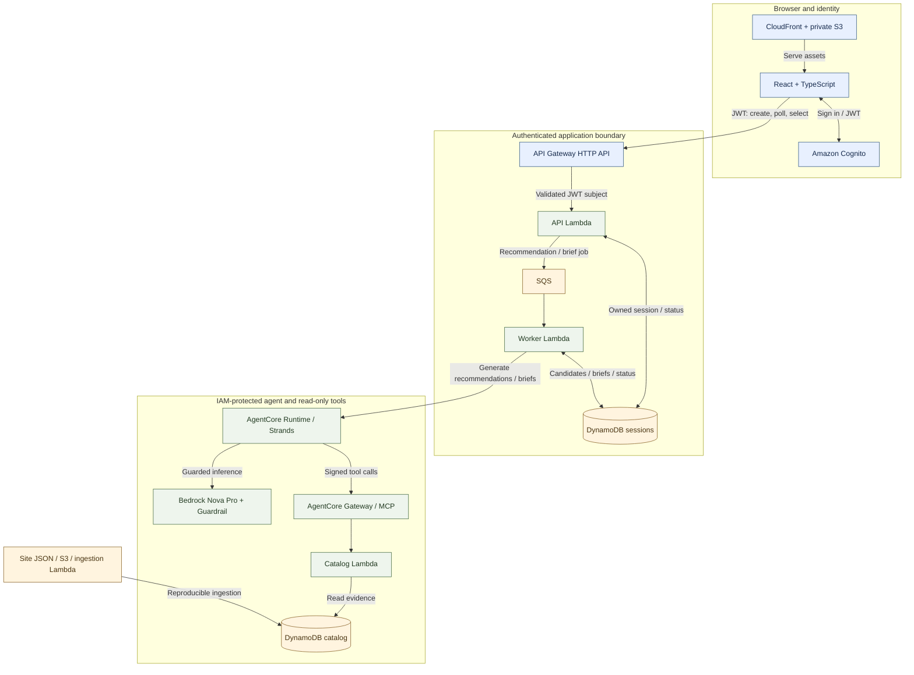
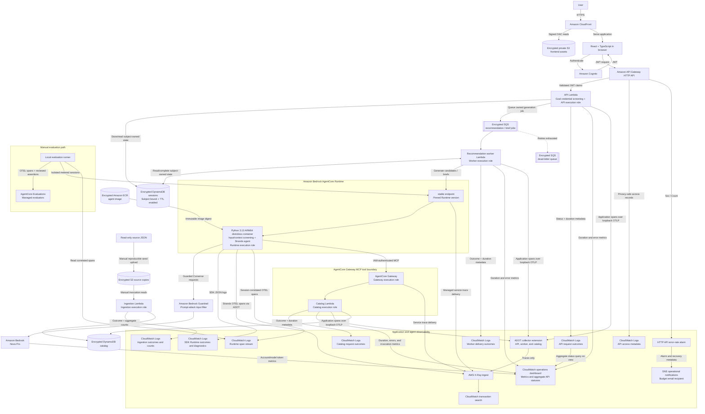

# praxis

An Amazon Bedrock and AgentCore app that uses personal evidence to recommend worthwhile software projects and turn ideas into actionable briefs.

I wanted to see a basic AgentCore app doing something mildly interesting.
I used my data from [barrettotte.github.io](https://github.com/barrettotte/barrettotte.github.io/tree/master/data).

Describe a learning goal, compare three evidence-backed candidates, then select
one for a brief with deliverables, milestones, risks, and acceptance checks.
Retrieval uses book, project, technical-note, and computing-museum metadata in
DynamoDB—not a semantic Knowledge Base or externally fetched book contents.

This is a single-user demonstration. Citations identify retrieved evidence;
they do not prove generated advice is correct or feasible. Do not submit secrets
or sensitive material. Security findings and deployment-verification gaps remain
open in the [security guide](docs/security.md#known-limitations).

## Try it

Sign in to the configured frontend and submit a non-sensitive goal, such as
“Suggest a weekend Python project about computing history using only my laptop.”
Compare the three candidates, inspect their cited resources, and select one for
a brief. Review its first step and completion checks before acting on it.
Both submission and selection can incur model costs; local Vite uses the
configured AWS backend, not an offline agent. Stop rather than repeatedly retrying
failures. See [operations](docs/infrastructure-operations.md) for setup and tokens.

## Architecture

### Tradeoffs and limitations

- Serverless services avoid always-on application servers but add AWS integration
  and cold-start overhead. AgentCore integration is an explicit goal of this demo.
- Lexical retrieval is sufficient for the small metadata catalog; citations do
  not substantiate unseen book contents or generated technical procedures.
- Recommendations and briefs use the same queue and worker. Retries can repeat
  paid inference, and budget alerts are not a spending cap.
- Sessions are subject-owned, but the catalog is shared. Additional users require
  explicit catalog authorization and data-isolation design, not merely another login.
  Private networking is justified only by a concrete traffic need.


The diagram describes the implementation, not current deployment health.
Use the [operating procedures](docs/infrastructure-operations.md) to inspect a deployment.



Recommendations and briefs run asynchronously: the browser polls subject-owned
job state for each buffered result. These
are logical access boundaries, not VPCs. Catalog evidence comes from curated
site JSON, not a semantic Knowledge Base. Each generation uses its supplied goal
and retrieved catalog evidence, without cross-session personalization.

CloudWatch logs, ADOT/X-Ray traces, the operations dashboard, and SNS alarm
routing support the workflow. The detailed view includes those flows,
image publication, and the manual evaluation path.

<details>
<summary>Detailed deployment, data, and observability view</summary>




</details>

Operational alerting is deployed; email subscription confirmation and delivery
verification remain open in the roadmap.

API Gateway is the application boundary, while AgentCore Gateway is the
authenticated tool boundary. Application routes use Cognito JWT authorization
and bind session access to the validated token subject;
AgentCore Runtime and Gateway remain IAM-authenticated internal boundaries.
The API rejects recognizable pasted credentials in new goals before storing or
queueing them. Runtime and CLI entry points share the detector; model-bound
retrieval and brief context are screened too. This is limited screening, not a guarantee that prompts or traces
are secret-free; see [input-screening limits](docs/agent-runtime.md#credential-isolation).
OpenTofu manages the AWS infrastructure.

## Development

Praxis is a monorepo with a Python backend in `backend/`, a React and TypeScript
application in `frontend/`, OpenTofu configuration in `infra/`, and evaluation
fixtures in `evals/`.

Prerequisites: Python 3.13, uv, Node.js 24–26, npm, and Make. Install locked
dependencies and run local checks without AWS credentials:

```bash
make bootstrap
make check
make help
```

Dependency installation needs network access. `make check` runs Ruff, type
checks, backend/frontend tests, and schema checks without AWS calls.
`make eval-check` runs the focused offline tests;
`make eval-artifact-check EVAL_RESULT=path` checks a local result against its policy. Neither
establishes the quality of current prompts or a deployed model.

Run `make security` to scan locked dependencies and the built local Runtime
image. It requires Podman (or `CONTAINER_TOOL=docker`) and network access, but
no AWS credentials. See [security scanning](docs/security.md#scanning) for
coverage, reports, and finding triage.

## Run with AWS

Model commands incur AWS charges even when run locally or with synthetic
fixtures. After following [account setup](docs/infrastructure-operations.md#account-access), configure
`.env` from `.env.example` and refresh the `praxis-dev` session before running:

```bash
make agent PROMPT='Build a small Python project inspired by computing history'
```

The CLI renders three candidates with evidence IDs. Use
`uv run praxis --data-dir data/fixtures --json 'your goal'` for synthetic catalog
inputs and JSON output; inference is still metered.

For the browser, follow [frontend setup](frontend/README.md) and run
`make dev-frontend`. Local Vite uses the configured AWS authentication/API;
it is not an offline application mode.

Deployed checks use `make smoke-dev`; the default is the non-inference
public-boundary suite. `./scripts/smoke/smoke-dev.sh --help` lists metered suites.
Review [cost controls](evals/README.md#cost-controls) before model smoke
tests or evaluations. Deployment and teardown require the reviewed
procedures in the [operations guide](docs/infrastructure-operations.md).

## Project guides

- [Agent runtime](docs/agent-runtime.md) and [API](docs/api.md): execution and contracts.
- [Evaluations](evals/README.md): test cases, metrics, and token controls.
- [Architecture](docs/architecture.md): component boundaries and design constraints.
- [Security](docs/security.md): trust boundaries, scanning, and known limitations.
- [Operations](docs/infrastructure-operations.md): account access, deployment, and teardown.
- [Roadmap](ROADMAP.md): implementation progress and open release gates.
